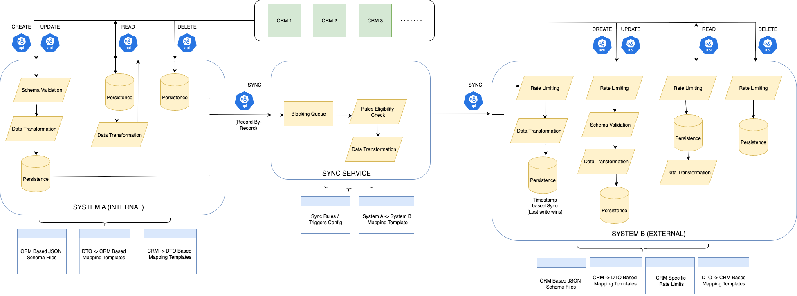
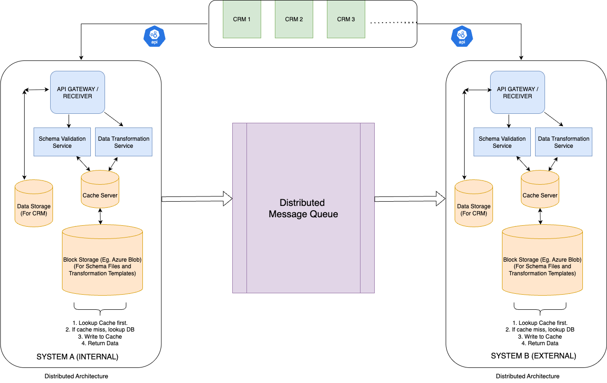
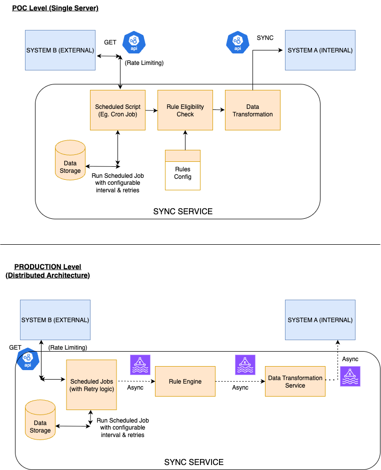

Bi-Directional Record Synchronization Application
-------------------------------------------------

PROBLEM STATEMENT : 
Bi-directional Record Synchronization Service that where 2 Systems (getting data from multiple sources) can keep their records in sync in real time.
One of the systems is a black box (mimicking an external system) only accessible via exposed CRUD APIs, also governed by rate limits.

FUNCTIONAL REQUIREMENTS :

In Scope for this POC :
- We need a Service A exposing CRUD APIs where multiple CRM providers can ingest their data
- We need a Service B (External) also exposing CRUD APIs but internal structure is abstract to Service A
- We need a Synchronization service to propogate messages from Service A to Service B
- Service B APIs are behind a rate limiting / throttling so CRUD and sync operations need to abide by it
- CRMs can have varied formats to ingest data
- We need to validate CRM input data against their respective schemas (as per contract) for correctness
- Service A and Service B can have different data structures to store the CRM data and they may also be different from CRM input format
  Therefore, we need a transformation feature to : 
      - map CRM input data to Service A and Service B (during ingestion)
      - map records from Service A to Service B during synchronization
- Synchronization needs to happen one record at a time
- Synchronization can be governed be rules or triggers that are pre-defined
  (Eg. For 'X' CRM allow so and so fields and only, Allow sync if record status = ACTIVE, Time based sync triggers etc.)
- Rules are pre-configured but rule evaluation should happen in real time during Synchronization

Out of scope for this POC (Future scope) :
- We need a Synchronization service to propogate messages from Service B (External) to Service A (Internal)

NON_FUNCTIONAL REQUIREMENTS :
- Data once ingested to Service A or Service B should not be lost or corrupted
- Data added to synchronization should not be lost before sync completes
- Sync process should happen in real time (without delays) as long as rate limits are respected
- Both Service A and Service B should reflect latest status of all records at all times
- Modularity of Low Level design should be maintained
- Services should follow REST API best practices and necessary exception handling

SYSTEM DESIGN (CURRENT SCOPE) :

PROD SCALE SYSTEM DESIGN (CURRENT SCOPE) : 

PROPOSED SYSTEM DESIGNS (FUTURE SCOPE) :

APPROACH AND DESIGN CHOICES :
- Built 3 separate services (Internal, External and Sync Service) to be run on localhost at different ports
- Different CRMs can provide data in different formats. I've considered taking input as JSON objects and perform JSON Schema validation.
  In real world applications, we form contracts between systems in order to send/recieve data.
  So I've created JSON Schemas of different formats (loaded in memory during bootup) which are nothing but contracts with different CRM providers.
- For Data Transformation, I have created template files (path to path mapping - loaded in memory during bootup) to translate different CRM inputs to
  Internal / External Service DTOs.
- For storage, I've created in memory Concurrent Hash Maps (record Id -> record object) in both Internal and External services. The record object DTO is different for both.
- Used Blocking Queue to store and process the sync messages from Internal to External System. Configured retry interval to handle Rate Limiting at External System.
  If blocked by rate limiter, sync service will put back the record in queue and re-attempt at configured interavl.
- Sync Rules defined in a config file loaded on bootup. Considerd a rule with list of allowed fields for one or more CRM providers. So for sync message, all the fields
  in input need to be present in this list in order for it to be synchronized.
  Made the rules config an array of ruleTypes where new rules can be defined in future (in separate classes)  and added to config seemlessly, also rules are loosely-coupled
  with CRM providers, so a rule may/may not neccessarily be applicable to all CRM providers. Also, Rules config can have a map of any kind of rules as defined in respective
  rule class (focussed on making it generic). (Check out sync-rules-config.json)
- Conflict Resolution during Sync : I'am maintaining a 'LastUpdated' timestamp for every record (during every CUD or Sync operation). If during any operation, the new incoming timestamp is after the existing timestamp in the system, only then the operation to write to system (Last-write wins). Therefore, records are always kept at their latest status.
- Used Chain of Responsibility Design Pattern in Java to proppogate the flow step by step (Easily scalable to add new service layer in the chain in future) :
  Create and Update APIs :
    - CRMs provide their CRM name (provider) and a list of records as input
    - Iterate over each record and perform below steps :
    - (Only for External Service) Rate Limiting based on configurable limit
    - Schema validation of input against respective JSON Schema of CRM Provider (Used Factory pattern for scalable design as CRM providers increase in future)
    - Data Transformation based on CRM Provider (Used Factory pattern for scalable design as CRM providers increase in future)
    - Store the record in DAO layer
    - (Only for Internal Service) Create a Sync Message (by tagging CRM Provider and Operation Type (Create/Update) against the record and send it to Sync Service via API call.
  Read API (Get Record By Id) :
    - CRMs provide their CRM name (provider) and a record id to fetch details
    - (Only for External Service) Rate Limiting based on configurable limit
    - Lookup the storage and get the details
    - Transform the service DTO object into CRM specific contract
    - Return the record
  Delete API :
    - CRMs provide their CRM name (provider) and list of record Ids to delete
    - (Only for External Service) Rate Limiting based on configurable limit
    - Delete the record from storage map
    - (Only for Internal Service) Create a Sync Message (by tagging CRM Provider and Operation Type (Delete) against the record and send it to Sync Service via API call.
  Sync Service -> Sync API :
    - Adds the sync message to Blocking Queue.
    - Run rules as per rules config file and allow sync if they pass.
    - Transform record from Service A format to Service B format (In Sync Message, we can plug in source and destination -> accordingly mapping templates will load - focussed on generic behaviour)
    - Create API call according to destination in sync message (Eg. External) and send the message.
    - If Rate Limit blocks the call, put the message back in queue and retry after a configurable interval of time.
  Extrenal System -> Sync API :
    - Rate Limiting based on configurable limit
    - In Sync Message, source System can plugin the operation (Create, Update, Delete). This is used at destination to update the DAO layer.
      Records are updated after comparing incoming timestmp with lastUpdatedTimestamp in the DB. If it's a newer entry, only then it's allowed to be written.
      (Last write wins approach for Conflict Resolution). 

TECH STACK :
- Java
- Spring Boot
- Maven
- Bucket 4j library (rate limiting)

RUN & TEST INSTRUCTIONS : 
Prerequisites
  - Java (17 or higher) : installed on the system
  - Maven : installed on the system
Run 
  - In the root folder, execute run-app.sh file.
  - It will bring up all 3 services on Localhost at different ports (Internal : 8081, External : 8082, Sync : 8083)
  - Refer Postman Collection 'Bi-Directional Sync Service.postman_collection.json' at the root folder to test the APIs.
  - Flows that can be tested : 
    - CRUD operations on Internal System
    - CRUD operations on External System
    - Sync Messages from Internal to External System (this is done during CRUD on Internal System itself and can be verifed by fetching records from External System)

